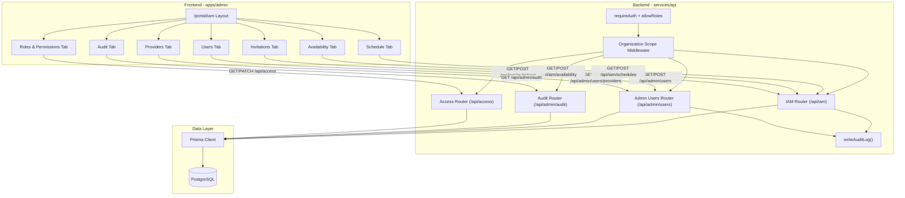
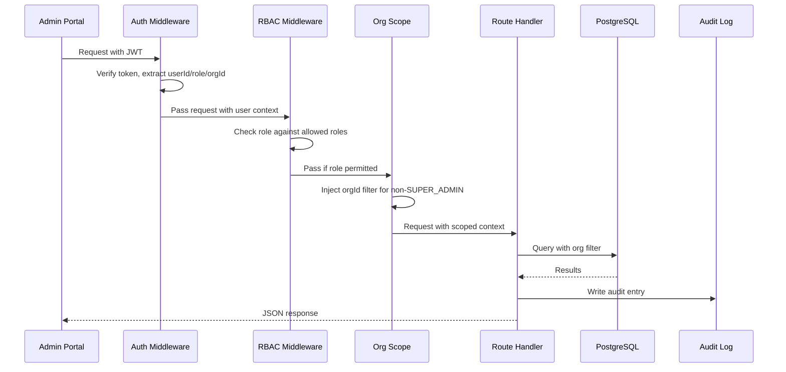

# Design Document: IAM Module

## Overview

The IAM Module is a centralized Identity & Access Management section within the CarePoint admin portal that consolidates user management, role-based access control, provider administration, scheduling, availability, invitations, and audit logging into a unified interface. It builds upon the existing infrastructure (User model with RBAC middleware, ProviderProfile, Appointments, ProviderScheduleTemplate, AuditLog) and surfaces these capabilities through a cohesive admin UI with organization-scoped access control.

### Design Goals

- **Unified Entry Point**: Single `/portal/iam` section with tab-based navigation across all sub-modules
- **Organization Isolation**: All data operations respect organization boundaries via middleware-enforced scoping
- **Leverage Existing Infrastructure**: Reuse Prisma models, Express middleware, and shared contracts rather than creating parallel structures
- **Consistent Patterns**: Follow existing module conventions (Router + service + Zod validation)
- **Audit Completeness**: Every mutation generates an audit entry for compliance

### Key Design Decisions

1. **Extend existing `admin-users` routes** rather than creating entirely new modules — the admin-users router already handles user/provider CRUD with organization scoping
2. **New `iam` router** for IAM-specific endpoints (invitations, access-review, schedule management) that don't fit existing modules
3. **Prisma schema additions** for Invitation model and PublishedSlot model; schedule templates already exist
4. **Frontend as a new route group** under `/portal/iam/` with shared layout and tab navigation
5. **Calendar component** uses an existing open-source React calendar library (react-big-calendar) for the schedule view

## Architecture

### System Architecture Diagram



### Request Flow



## Components and Interfaces

### Backend Components

#### 1. IAM Router (`services/api/src/modules/iam/iam.routes.ts`)

New Express router consolidating IAM-specific endpoints:

```typescript
// Invitations
POST   /api/iam/invitations          // Create invitation
GET    /api/iam/invitations          // List invitations
PATCH  /api/iam/invitations/:id/revoke  // Revoke invitation
POST   /api/iam/invitations/:token/accept  // Accept invitation (public)

// Schedule Management
GET    /api/iam/schedules/:providerId/appointments  // Provider appointments
POST   /api/iam/schedules/:providerId/appointments  // Create appointment
PATCH  /api/iam/schedules/appointments/:id          // Reschedule
PATCH  /api/iam/schedules/appointments/:id/cancel   // Cancel appointment

// Availability Management
GET    /api/iam/availability/:providerId/templates   // List templates
POST   /api/iam/availability/:providerId/templates   // Create template
PATCH  /api/iam/availability/templates/:id           // Update template
POST   /api/iam/availability/templates/:id/publish   // Publish template
POST   /api/iam/availability/:providerId/time-off    // Create time-off block
GET    /api/iam/availability/:providerId/slots       // List published slots

// Access Review
GET    /api/iam/access-review        // List users needing role re-certification
```

#### 2. Organization Scope Middleware (`services/api/src/middleware/org-scope.ts`)

New middleware that enforces organization boundaries:

```typescript
export function enforceOrgScope(req: Request, _res: Response, next: NextFunction) {
  if (!req.user) return next(unauthorized('Authentication required'));
  
  // SUPER_ADMIN bypasses org scoping
  if (req.user.role === 'SUPER_ADMIN') return next();
  
  // All other roles must have organizationId
  if (!req.user.organizationId) {
    return next(unauthorized('Missing organization context'));
  }
  
  // Attach org filter for use in handlers
  req.orgFilter = { organizationId: req.user.organizationId };
  next();
}
```

#### 3. Invitation Service (`services/api/src/modules/iam/invitation.service.ts`)

Handles invitation token generation and lifecycle:

```typescript
interface CreateInvitationInput {
  email: string;
  role: UserRole;
  organizationId: string;
  expiresInHours?: number; // default 72, range 1-720
  actorId: string;
}

interface InvitationResult {
  id: string;
  token: string;
  email: string;
  role: UserRole;
  organizationId: string;
  expiresAt: Date;
  status: 'PENDING' | 'ACCEPTED' | 'EXPIRED' | 'REVOKED';
}
```

#### 4. Schedule Service (`services/api/src/modules/iam/schedule.service.ts`)

Handles appointment conflict detection and scheduling:

```typescript
interface CreateAppointmentInput {
  providerId: string;
  patientId: string;
  service: string;
  location: string;
  startsAt: Date;
  endsAt: Date;
  organizationId: string;
}

interface ConflictCheckResult {
  hasConflict: boolean;
  conflictingAppointments: Array<{ id: string; startsAt: Date; endsAt: Date }>;
  outsideBookableWindow: boolean;
}
```

#### 5. Availability Service (`services/api/src/modules/iam/availability.service.ts`)

Manages schedule templates and slot generation:

```typescript
interface ScheduleTemplateInput {
  name: string;           // min 2 chars
  providerId: string;
  organizationId: string;
  dayPatterns: DayPattern[];
  serviceType: string;
  location: string;
  serviceModes: string[];
  duration: number;       // 1-480 minutes
  buffer: number;         // 0-120 minutes
  capacity: number;       // 1-20
}

interface DayPattern {
  dayOfWeek: 0 | 1 | 2 | 3 | 4 | 5 | 6;
  startTime: string;  // HH:mm
  endTime: string;    // HH:mm
}
```

### Frontend Components

#### 1. IAM Layout (`apps/admin/src/app/portal/iam/layout.tsx`)

Shared layout with tab navigation:

```typescript
// Tabs: Usuarios | Roles y Permisos | Proveedores | Agenda | Disponibilidad | Invitaciones | Auditoría
```

#### 2. Users Page (`apps/admin/src/app/portal/iam/users/page.tsx`)

- Paginated table (20 items/page)
- Search filter (name, email, role)
- Create user dialog
- Status management (ACTIVE/SUSPENDED/ARCHIVED)
- Organization column for Super Admin

#### 3. Roles Page (`apps/admin/src/app/portal/iam/roles/page.tsx`)

- Role list with descriptions
- Permission matrix grid
- Role assignment dialog with reason field
- Access review list (stale certifications)

#### 4. Providers Page (`apps/admin/src/app/portal/iam/providers/page.tsx`)

- Provider list with onboarding status badges
- Credential summary (VALID/EXPIRING_SOON/EXPIRED)
- Provider detail drawer with credential docs and review tasks
- Onboarding state machine controls

#### 5. Schedule Page (`apps/admin/src/app/portal/iam/schedule/page.tsx`)

- Calendar view (day/week/month) using react-big-calendar
- Provider selector (scoped to organization)
- Appointment creation/editing dialogs
- Color-coded status indicators

#### 6. Availability Page (`apps/admin/src/app/portal/iam/availability/page.tsx`)

- Weekly grid view for recurring schedule
- Template creation form with validation
- Publish/unpublish controls
- Time-off block creation
- Slot preview

#### 7. Invitations Page (`apps/admin/src/app/portal/iam/invitations/page.tsx`)

- Invitation list with status badges
- Create invitation dialog
- Revoke action with confirmation
- Expiration countdown display

#### 8. Audit Page (`apps/admin/src/app/portal/iam/audit/page.tsx`)

- Reverse-chronological table (50 items/page)
- Filters: action type, resource type, actor, date range
- Export dialog (JSON/CSV) with purpose field
- Detail view with structured change data
- Resource navigation links

## Data Models

### New Prisma Models

#### Invitation

```prisma
enum InvitationStatus {
  PENDING
  ACCEPTED
  EXPIRED
  REVOKED
}

model Invitation {
  id             String           @id @default(cuid())
  organizationId String
  email          String
  role           UserRole
  tokenHash      String           @unique
  status         InvitationStatus @default(PENDING)
  expiresAt      DateTime
  acceptedAt     DateTime?
  revokedAt      DateTime?
  createdById    String
  consumedById   String?
  createdAt      DateTime         @default(now())
  updatedAt      DateTime         @updatedAt
  organization   Organization     @relation(fields: [organizationId], references: [id])
  createdBy      User             @relation("InvitationCreator", fields: [createdById], references: [id])
  consumedBy     User?            @relation("InvitationConsumer", fields: [consumedById], references: [id])

  @@index([organizationId, status])
  @@index([email])
}
```

#### PublishedSlot

```prisma
enum SlotStatus {
  AVAILABLE
  HELD
  BOOKED
}

model PublishedSlot {
  id             String        @id @default(cuid())
  organizationId String
  providerId     String
  templateId     String?
  startsAt       DateTime
  endsAt         DateTime
  service        String
  location       String
  capacity       Int           @default(1)
  bookedCount    Int           @default(0)
  status         SlotStatus    @default(AVAILABLE)
  createdAt      DateTime      @default(now())
  updatedAt      DateTime      @updatedAt
  organization   Organization  @relation(fields: [organizationId], references: [id])
  provider       ProviderProfile @relation(fields: [providerId], references: [id])
  template       ProviderScheduleTemplate? @relation(fields: [templateId], references: [id])

  @@index([organizationId, providerId, startsAt])
  @@index([templateId])
}
```

#### TimeOffBlock

```prisma
model TimeOffBlock {
  id             String        @id @default(cuid())
  organizationId String
  providerId     String
  startsAt       DateTime
  endsAt         DateTime
  reason         String?
  createdById    String
  createdAt      DateTime      @default(now())
  updatedAt      DateTime      @updatedAt
  organization   Organization  @relation(fields: [organizationId], references: [id])
  provider       ProviderProfile @relation(fields: [providerId], references: [id])
  createdBy      User          @relation(fields: [createdById], references: [id])

  @@index([organizationId, providerId, startsAt])
}
```

### Existing Models (Extended)

The following existing models are used as-is:

| Model | Usage in IAM |
|-------|-------------|
| `User` | User list, status management, role assignment |
| `Organization` | Scoping all operations |
| `ProviderProfile` | Provider management, schedule/availability |
| `ProviderOnboardingState` | Onboarding status machine |
| `ProviderCredentialDocument` | Credential verification display |
| `Appointment` | Calendar view, scheduling |
| `ProviderScheduleTemplate` | Availability recurring patterns |
| `AuditLog` | Audit trail |
| `RefreshToken` | Session revocation on status/role change |

### Zod Validation Schemas

```typescript
// Invitation creation
const createInvitationSchema = z.object({
  email: z.string().email(),
  role: z.enum(['COMPANY_ADMIN', 'COMPANY_SUPPORT', 'PROVIDER', 'NURSE', 'PHARMACIST', 'LAB_TECH', 'FINANCE']),
  expiresInHours: z.number().min(1).max(720).optional().default(72),
});

// Appointment creation
const createAppointmentSchema = z.object({
  patientId: z.string().min(1),
  service: z.string().min(1),
  location: z.string().min(1),
  startsAt: z.string().datetime(),
  endsAt: z.string().datetime(),
});

// Schedule template creation
const createTemplateSchema = z.object({
  name: z.string().min(2),
  dayPatterns: z.array(z.object({
    dayOfWeek: z.number().min(0).max(6),
    startTime: z.string().regex(/^\d{2}:\d{2}$/),
    endTime: z.string().regex(/^\d{2}:\d{2}$/),
  })).min(1),
  serviceType: z.string().min(1),
  location: z.string().min(1),
  serviceModes: z.array(z.string()).min(1),
  duration: z.number().min(1).max(480),
  buffer: z.number().min(0).max(120).default(0),
  capacity: z.number().min(1).max(20).default(1),
});

// Time-off block
const createTimeOffSchema = z.object({
  startsAt: z.string().datetime(),
  endsAt: z.string().datetime(),
  reason: z.string().optional(),
});

// Role change
const changeRoleSchema = z.object({
  role: z.enum(['SUPER_ADMIN', 'COMPANY_ADMIN', 'COMPANY_SUPPORT', 'PROVIDER', 'NURSE', 'PHARMACIST', 'LAB_TECH', 'FINANCE', 'PATIENT']),
  reason: z.string().min(1).max(500),
});

// User creation
const createUserSchema = z.object({
  firstName: z.string().min(1),
  lastName: z.string().min(1),
  email: z.string().email(),
  role: z.nativeEnum(UserRole),
  organizationId: z.string().optional(),
});

// Appointment cancellation
const cancelAppointmentSchema = z.object({
  reason: z.string().min(1).max(500),
});

// Audit export
const auditExportSchema = z.object({
  format: z.enum(['json', 'csv']).default('json'),
  purpose: z.string().min(1),
});
```


## Correctness Properties

*A property is a characteristic or behavior that should hold true across all valid executions of a system — essentially, a formal statement about what the system should do. Properties serve as the bridge between human-readable specifications and machine-verifiable correctness guarantees.*

### Property 1: Organization Boundary Enforcement

*For any* authenticated non-SUPER_ADMIN user (Company_Admin, Provider, etc.) performing any IAM read or write operation, all returned results and all created/modified records SHALL belong exclusively to the user's own organization (matching the JWT organizationId claim).

**Validates: Requirements 1.2, 1.5, 1.8, 3.4, 3.6, 4.3, 4.11, 5.5, 5.6, 6.8, 7.2, 8.1, 8.2, 8.5**

### Property 2: IAM Mutations Produce Audit Entries

*For any* IAM mutation (user creation, role change, status change, invitation event, appointment modification, schedule change, availability change), the system SHALL write an audit entry containing the actor ID, action type, resource identifier, organization ID, and relevant change details.

**Validates: Requirements 2.3, 2.6, 4.9, 4.10, 5.10, 6.12, 7.7**

### Property 3: Pagination and Sort Order

*For any* paginated IAM list query (users at 20/page, audit at 50/page), the returned page SHALL contain at most the configured page size and all items SHALL be sorted by creation date in descending order (newest first).

**Validates: Requirements 1.1, 7.1**

### Property 4: Resource Serialization Completeness

*For any* user, provider, appointment, or schedule template returned by an IAM endpoint, the serialized response SHALL include all fields required by the specification (user: name, email, role, org, status, createdAt; provider: name, specialty, license, onboardingStatus, credentialSummary; appointment: start, end, patient, service, location, status; template: name, day patterns, time ranges, service, location, status).

**Validates: Requirements 1.3, 3.1, 4.4, 5.1**

### Property 5: Credential Verification Status Computation

*For any* provider credential document, the computed verification status SHALL be VALID when the document is verified and expiresAt is more than 30 days in the future, EXPIRING_SOON when verified and expiresAt is within 30 days, and EXPIRED when expiresAt has passed.

**Validates: Requirements 3.7**

### Property 6: Onboarding State Machine Transitions

*For any* provider onboarding status and attempted transition, the system SHALL accept the transition only if it follows the allowed paths: DRAFT → READY_FOR_REVIEW, READY_FOR_REVIEW → APPROVED | REJECTED | REQUEST_CHANGES, REQUEST_CHANGES → READY_FOR_REVIEW. All other transitions SHALL be rejected.

**Validates: Requirements 3.5, 3.8**

### Property 7: Appointment Conflict Detection and Bookable Window

*For any* appointment creation or reschedule request, the system SHALL reject the request if the time falls outside the bookable window (06:00–23:00 UTC) or if the time range overlaps with any existing non-cancelled appointment for the same provider.

**Validates: Requirements 4.7, 4.8, 4.9**

### Property 8: Text Search Filter Correctness

*For any* search term applied to the user list, all returned results SHALL contain the search term as a case-insensitive substring match in at least one of: full name, email, or role.

**Validates: Requirements 1.7**

### Property 9: Invitation Token Acceptance Validation

*For any* invitation token acceptance attempt, the system SHALL succeed only if the token has not expired (current time < expiresAt), has not been previously consumed (status ≠ ACCEPTED), and has not been revoked (status ≠ REVOKED). Otherwise it SHALL return an appropriate error.

**Validates: Requirements 6.3, 6.5, 6.6, 6.9**

### Property 10: Invitation Acceptance Creates Correct User

*For any* valid invitation that is successfully accepted, the system SHALL create a user account with the role and organizationId specified in the invitation, and mark the invitation status as ACCEPTED.

**Validates: Requirements 6.4**

### Property 11: Cannot Invite Existing Active User

*For any* invitation creation request where the email belongs to an existing user with ACTIVE status, the system SHALL reject the request with an error.

**Validates: Requirements 6.10**

### Property 12: SUPER_ADMIN Role Escalation Prevention

*For any* Company_Admin attempting to assign the SUPER_ADMIN role (via role change or invitation creation), the system SHALL reject the request with a 403 Forbidden response.

**Validates: Requirements 2.4, 6.11**

### Property 13: Last COMPANY_ADMIN Protection

*For any* role change that would result in zero users with the COMPANY_ADMIN role remaining in an organization, the system SHALL reject the change with an error indicating the organization must retain at least one COMPANY_ADMIN.

**Validates: Requirements 2.5**

### Property 14: Role Change Revokes Sessions

*For any* successful role change applied to a user, all existing refresh tokens for that user SHALL be revoked (revokedAt set to current timestamp).

**Validates: Requirements 2.8**

### Property 15: Schedule Template Validation

*For any* schedule template creation or update request, the system SHALL reject if name is less than 2 characters, duration is outside 1–480 minutes, buffer is outside 0–120 minutes, or capacity is outside 1–20.

**Validates: Requirements 5.2, 5.9**

### Property 16: Slot Generation Covers Planning Horizon

*For any* published schedule template, the system SHALL generate published slots covering a 21-day horizon from the current date, and no generated slot SHALL conflict with an existing booked appointment for the same provider.

**Validates: Requirements 5.3**

### Property 17: Time-Off Removes Only Available Slots

*For any* time-off block creation, the system SHALL remove all published slots with status AVAILABLE that overlap the time-off period, and SHALL NOT remove any slot that has active holds or booked appointments.

**Validates: Requirements 5.4**

### Property 18: Template Modification Preserves Booked Slots

*For any* modification to a published schedule template, future unbooked slots generated from that template SHALL be removed and regenerated from the updated pattern, while all slots with booked appointments SHALL be preserved unchanged.

**Validates: Requirements 5.8**

### Property 19: Access Review Returns Stale Certifications

*For any* user with SUPER_ADMIN or COMPANY_ADMIN role whose last role certification timestamp is older than 90 days, that user SHALL appear in the access-review endpoint results. Users with certifications within 90 days SHALL NOT appear.

**Validates: Requirements 2.7**

### Property 20: Permission Check Before Organization Scope

*For any* IAM request where the authenticated user's role lacks the required permission, the system SHALL return 403 with an insufficient permissions error and SHALL NOT evaluate organization-scope rules or execute the requested operation.

**Validates: Requirements 8.4, 8.8**

### Property 21: Cancellation Reason Validation

*For any* appointment cancellation request, the system SHALL require a reason string between 1 and 500 characters. Reasons outside this range SHALL be rejected.

**Validates: Requirements 4.10**

### Property 22: Audit Filter AND Combination

*For any* set of active audit filters (action type, resource type, actor, date range), all returned audit entries SHALL satisfy every active filter simultaneously (AND logic). The date range SHALL default to the last 30 days and SHALL NOT exceed 365 days.

**Validates: Requirements 7.4**

### Property 23: Audit Export Entry Limit

*For any* audit export request, the system SHALL return at most 10,000 entries. If the filter matches more than 10,000 entries, the system SHALL return an error indicating the result set exceeds the limit.

**Validates: Requirements 7.5, 7.6**

### Property 24: Invitation Token Security

*For any* created invitation, the generated token SHALL be cryptographically secure with at least 32 bytes of entropy, the expiration SHALL be between 1 hour and 30 days (defaulting to 72 hours), and the token SHALL be stored as a hash (not plaintext).

**Validates: Requirements 6.1, 6.2**

## Error Handling

### HTTP Error Responses

| Status Code | Scenario | Response Body |
|-------------|----------|---------------|
| 400 Bad Request | Validation failure (missing fields, invalid format, duplicate email, invalid state transition) | `{ error: string, code?: string, field?: string }` |
| 401 Unauthorized | Missing/invalid JWT, missing organizationId claim | `{ error: "Missing access token" \| "Invalid access token" \| "Missing organization context" }` |
| 403 Forbidden | Insufficient role, org boundary violation, SUPER_ADMIN escalation attempt | `{ error: string }` describing the specific denial reason |
| 404 Not Found | Resource does not exist or is not visible to the requesting user | `{ error: "{Resource} not found" }` |
| 409 Conflict | Appointment time conflict, slot overlap | `{ error: string, conflicts?: Array<{ id, startsAt, endsAt }> }` |

### Error Handling Strategy

1. **Validation Errors**: Caught at the Zod schema layer before reaching service logic. Return 400 with field-specific messages.
2. **Authorization Errors**: Caught by RBAC middleware (role check) and org-scope middleware (boundary check). Return 401/403.
3. **Business Rule Violations**: Caught in service layer (conflict detection, state machine validation, last-admin check). Return 400 or 409.
4. **Database Errors**: Caught by existing `error-handler.ts` middleware. Prisma unique constraint violations mapped to 400. Other DB errors return 500 with generic message.
5. **Audit Logging Failures**: Non-blocking. Audit write failures are logged to console but do not fail the primary operation (following existing `safeWriteAccountAuditLog` pattern).

### Idempotency

- Invitation acceptance is idempotent — accepting an already-accepted token returns a friendly error (not a crash)
- Role assignment checks for duplicates before creating
- Time-off slot removal is idempotent — re-creating the same time-off block does not error if slots were already removed

## Testing Strategy

### Property-Based Testing

This feature is appropriate for property-based testing because it contains multiple pure functions (credential status computation, state machine validation, conflict detection, filter logic) and universal invariants (organization scoping, audit completeness) that hold across a wide input space.

**Library**: [fast-check](https://github.com/dubzzz/fast-check) (already available in the vitest ecosystem used by the project)

**Configuration**:
- Minimum 100 iterations per property test
- Each property test tagged with: `Feature: iam-module, Property {N}: {title}`

**Properties to implement as PBT**:
- Property 1: Organization boundary enforcement (generate random users/orgs, verify scoping)
- Property 5: Credential status computation (generate random dates, verify classification)
- Property 6: Onboarding state machine (generate all state+transition pairs, verify acceptance/rejection)
- Property 7: Appointment conflict detection (generate random time ranges, verify overlap detection)
- Property 8: Text search filter (generate random users and search terms, verify match correctness)
- Property 9: Invitation token acceptance (generate tokens in all states, verify acceptance logic)
- Property 12: SUPER_ADMIN escalation prevention (generate role changes from Company_Admin, verify rejection)
- Property 13: Last COMPANY_ADMIN protection (generate orgs with varying admin counts, verify invariant)
- Property 15: Schedule template validation (generate random template inputs, verify constraint enforcement)
- Property 16: Slot generation (generate templates, verify 21-day coverage without conflicts)
- Property 17: Time-off slot removal (generate slots + time-off blocks, verify only AVAILABLE removed)
- Property 21: Cancellation reason validation (generate strings of varying length, verify 1-500 accepted)
- Property 22: Audit filter AND logic (generate entries + filters, verify all results satisfy all filters)
- Property 24: Invitation token security (verify token entropy and hash storage)

### Unit Tests (Example-Based)

- User creation with valid/invalid inputs
- Provider creation with linked records
- Calendar view mode rendering (day/week/month)
- Audit detail view with deleted resource link
- Empty state display when filters return nothing
- Role/permission matrix display

### Integration Tests

- End-to-end invitation flow (create → send → accept → verify user created)
- Schedule publish → time-off → verify slot removal
- Role change → verify session revocation → verify re-auth required
- Audit export with metadata header verification
- Cross-org access denial (full HTTP round-trip)

### Test File Organization

```
services/api/src/__tests__/
  iam/
    org-scope.property.test.ts
    credential-status.property.test.ts
    onboarding-state-machine.property.test.ts
    appointment-conflict.property.test.ts
    search-filter.property.test.ts
    invitation-lifecycle.property.test.ts
    template-validation.property.test.ts
    slot-generation.property.test.ts
    audit-filters.property.test.ts
    iam-integration.test.ts
    invitation-flow.test.ts
```
